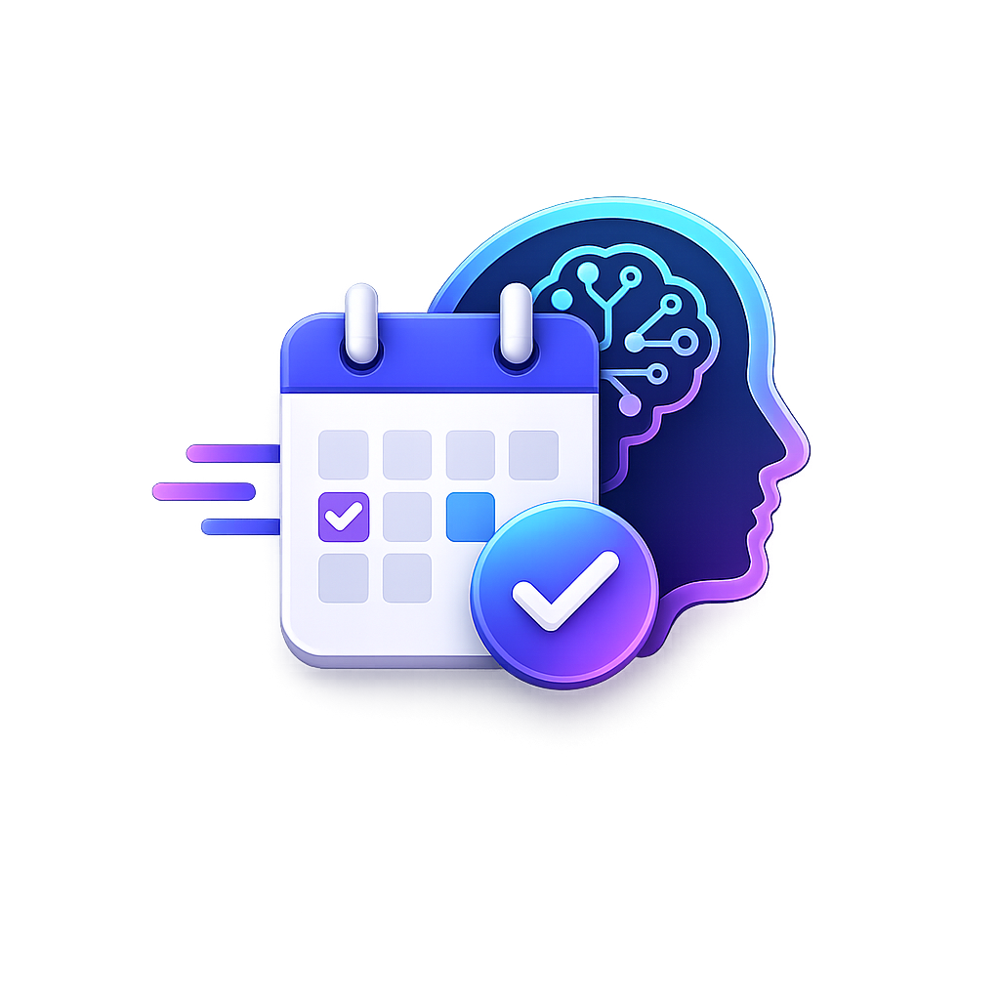

# 🚀 Last Minute

> **An AI-powered productivity assistant that helps users organize tasks, create smart schedules, manage deadlines, and improve productivity using Google Gemini AI.**

<p align="center">
  
</p>

---

## 📱 Download Android App

### APK

👉 **Download the latest Android APK**

**https://github.com/ishitatomar/last-minute-life-saver-app/releases/download/v1.0.0/LastMinute-v1.0.0.apk**

---

## 🌐 Features

### 🔐 Authentication
- Google Sign-In using Firebase Authentication
- Persistent Login (Login Once)
- Secure User Sessions

### ✅ Task Management
- Create Tasks
- Delete Tasks
- Mark Tasks as Complete
- Undo Completed Tasks
- Categorize Tasks
- Priority Levels
- Due Dates

### 🤖 AI Productivity Assistant
- Powered by Google Gemini AI
- Smart Task Prioritization
- Daily Planning
- Study Schedule Generation
- Productivity Analysis
- Task Breakdown
- Motivational Suggestions
- Focus Plans

### 📅 Smart Calendar
- Interactive Calendar
- View Tasks by Date
- AI Schedule Generator
- Upcoming Deadlines
- Monthly Calendar View

### 📊 Analytics Dashboard
- Task Completion Statistics
- Productivity Score
- Completion Rate
- Category-wise Task Analysis
- Pie Charts
- Bar Charts
- Upcoming Deadlines
- AI Productivity Insights

### 👤 User Profile
- Google Profile Integration
- Account Information
- Achievement System
- Recent Activity
- Notification Settings
- Secure Logout

### 📱 Mobile App
- Android Application using Capacitor
- Responsive Mobile UI
- Mobile Navigation Drawer
- Native Google Login
- Android Back Button Support

---

# 🛠 Tech Stack

## Frontend
- React
- Vite
- Tailwind CSS
- React Router

## Backend & Database
- Firebase Authentication
- Cloud Firestore

## AI
- Google Gemini API

## Mobile
- Capacitor
- Android Studio

## Charts & Calendar
- Recharts
- Moment.js

---

# 📂 Project Structure

```
src/
│
├── components/
│
├── context/
│
├── firebase/
│
├── pages/
│   ├── Landing
│   ├── Login
│   ├── Dashboard
│   ├── Calendar
│   ├── AIChat
│   ├── Analytics
│   └── Profile
│
├── services/
│
├── App.jsx
│
└── main.jsx
```

---

# 🚀 Installation

Clone the repository

```bash
git clone https://github.com/ishitatomar/last-minute-life-saver-app.git
```

Move into the project directory

```bash
cd last-minute-life-saver-app
```

Install dependencies

```bash
npm install
```

Start the development server

```bash
npm run dev
```

---

# 📱 Android Build

```bash
npm run build
npx cap sync
npx cap open android
```

---

# 💡 AI Features

- Daily Planner
- Smart Scheduling
- Productivity Suggestions
- Study Planner
- Task Breakdown
- Priority Recommendations
- Motivation Assistant


---

# 🔒 Authentication

- Firebase Authentication
- Google OAuth
- Persistent Login
- Secure User Sessions

---

# 🎯 Future Enhancements

- Push Notifications
- Offline Support
- Dark / Light Theme
- Recurring Tasks
- Task Reminders
- Export Calendar
- AI Voice Assistant

---


## 📄 License

This project is developed for educational and portfolio purposes.
